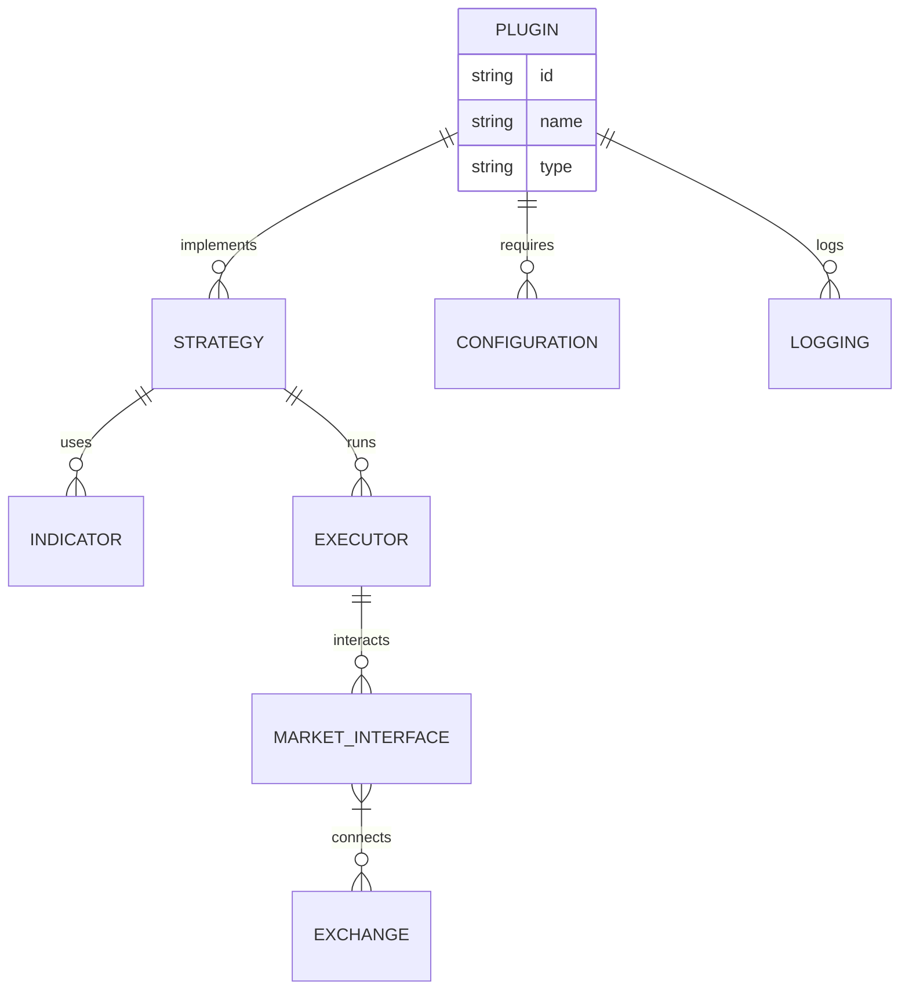

[](https://x.com/Stock_finance)
[](https://discord.com/invite/xPHTuHCmuV)
[](https://vscode.dev/redirect?url=vscode://ms-vscode-remote.remote-containers/cloneInVolume?url=https://github.com/Stock-finance/Stock)
<a href="https://codespaces.new/Stock-finance/Stock">
  
</a>
<a target="_blank" href="https://colab.research.google.com/github/Stock-finance/Stock/blob/develop/examples/googleColab.ipynb">
  
</a>


## Why Stock Plugins?
Most scripts inside this repository are technical indicator automated trading. These scripts include various types of momentum trading, opening range breakout, reversal of support & resistance and statistical arbitrage strategies. Yet, quantitative trading is not only about technical analysis. It can refer to computational finance to exploit derivative price mismatch, pattern recognition on alternative datasets to generate alphas or low latency order execution in the market microstructure. Hence, there are a few ongoing projects inside this repository. These projects are mostly quantamental analysis on some strange ideas I come up with to beat the market (or so I thought). There is no HFT strategy simply because ultra high frequency data are very expensive to acquire (even consider platforms like Quantopian or Quandl). Additionally, please note that, all scripts are historical data backtesting/forward testing (basically via Python, not C++, maybe Julia in the near future). The assumption is that all trades are frictionless. No slippage, no surcharge, no illiquidity. Last but not least, all scripts contain a global function named main so that you can embed the scripts directly into you trading system (although too lazy to write docstring).

<a>
  <div align="center">
  
  </div>
</a>


They are:
- 🔌 Modular & reusable components
- 📦 Environment-agnostic (backtest, sandbox, live)
- 🧩 Easy to plug into any strategy or workflow
- 🌐 Exchange-agnostic with unified interfaces

Create, share, or combine plugins for indicators, strategies, risk controls, and more — all while keeping your code clean and scalable.

### v3.0发布，前端分离，项目和部署整合到一起

修改接口展示空。修改数据库脚本。
解决预测数据买和卖的脚本。
进行缩减、计算相关添加操作。
修改启动脚本、接口路径及配置。
设置分页数据。增加联合主键判断。
解决分页问题并执行查询语句。
增加日期查询方法。
进行数据搜索相关添加操作。
添加配置。修改路由地址。
解决端口映射问题及修改端口测试。
拆分前后端，用 dockerfile 构建镜像并解决前端编译问题。
修改开发者模式，解决本地开发启动问题。
增加地址。增加前端开发者模式启动。
增加每天数据跑批。进行猜工作相关添加操作。
增加日志跑数据。升级增加展示。
架构升级并使用 vue 的 ui 开发。
增加 install docker 说明。
添加 vue api。

## Stock Workspace

While the Stock Platform is all about an integration to dozens of different data vendors, the interface is either Python or a CLI.

If you want an enterprise UI to visualize this datasets and use AI agents on top, you can find Stock Workspace at.


### 架构设计
全系使用python实现。因为都是python的类库，互相之间调用方便。
从数据抓取，数据处理，到数据展示数据运算都是python实现。

最终的数据都到前端展示出来。主要分为4个文件夹。

> jobs 抓取数据并存储实现类。
> 
> libs 通用工具类。
> 
> web 前端展示框架。
> 
> supervisor 进程管理工具。


```python
import Stock
"""
This example shows how backtest over tweets
"""

class TwitterBot(Stock.Model):
    def main(self, args):
        while self.has_data:
            self.backtester.value_account()
            self.sleep('1h')

    def event(self, type_: str, data: str):
        # Now check if it's a tweet about Tesla
        if 'tsla' in data.lower() or 'gme' in data.lower():
            # Buy, sell or evaluate your portfolio
            pass


if __name__ == "__main__":
    exchange = Stock.Alpaca()
    model = TwitterBot(exchange)

    # Add the tweets json here
    model.backtester.add_custom_events(Stock.data.JsonEventReader('./tweets.json'))
    # Now add some underlying prices at 1 month
    model.backtester.add_prices('TSLA', '1h', start_date='3/20/22', stop_date='4/15/22')

    # Backtest or run live
    print(model.backtest(args=None, initial_values={'USD': 10000}))

```

## 🛠️ Installation

```

PythonStock V3.0 是基于Python的pandas，akshare，bokeh，tornado，stockstats，ta-lib等框架开发的全栈股票系统。
项目创建于2017年7月17日，每月不定期更新。
1）可以直接使用docker直接本地部署运行，整个项目在docker hub上压缩后200MB，本地占用500MB磁盘空间。
2）使用Docker解决了Python库安装问题，使用Mariadb（MySQL）存储数据。借助akshare抓取数据。
3）使用cron做定时任务，每天进行数据抓取计算，每天18点开始进行数据计算，计算当日数据，使用300天数据进行计算，大约需要15分钟计算完毕。
4）股票数据接口防止被封，按天进行数据缓存，储存最近3天数据，每天定时清除，同时使用read_pickle to_pickle 的gzip压缩模式存储。
5）使用tornado开发web系统，支持每日股票数据-东财，龙虎榜-个股上榜-新浪，数据中心-大宗交易行情等。
6）数据展示系统，是通用数据展示系统，配置字典模板之后，页面自动加载数据，并完成数据展示，后续自己开发的指标数据可以加入进去。
7）增加曲线数据分析，在查看股票中，可以直接跳转到东方财富页面查看相关信息，点击指标之后使用Bokeh将多达 17 个指标的数据绘图，进行图表展示。
8）2.0 最大的更新在于替换tushare库（因部分库不能使用），使用akshare进行数据抓取。
9）3.0 主要做的是项目整合，前端使用vue开发了，后端使用API,使用docker-compose开发部署。

基础库版本

1，pandas使用【 2.2.3 】版本， 
2，numpy使用【 2.2.1 】版本， 
3，sqlalchemy使用【 2.0.36 】版本， 
4，akshare使用【 1.15.59 】版本， 
5，bokeh使用【 3.6.2 】版本， 
6，stockstats使用【 0.3.2 】版本， 

```




<p align="center">
    
</p>

<p align="center">
  </center>
</p>

## Contributors

 wouldn't be  without you. If we are going to disrupt financial industry, every contribution counts. Thank you for being part of this journey.

<a href="https://github.com/Stock-finance/Stock/graphs/contributors">
   
</a>
